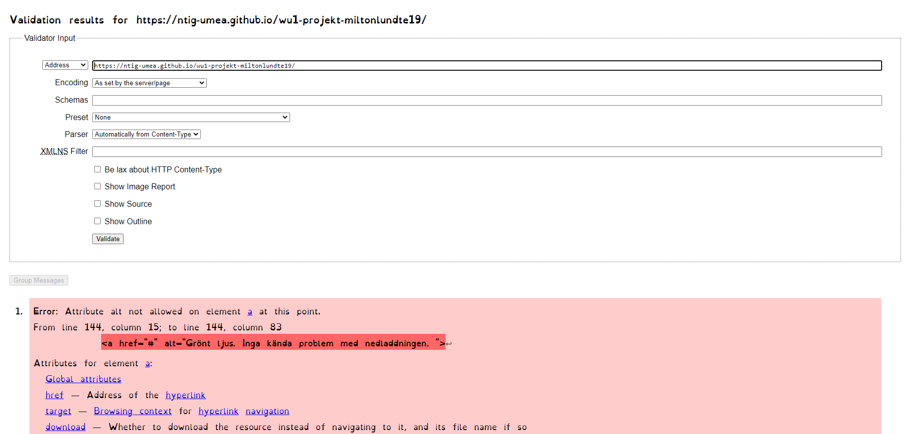
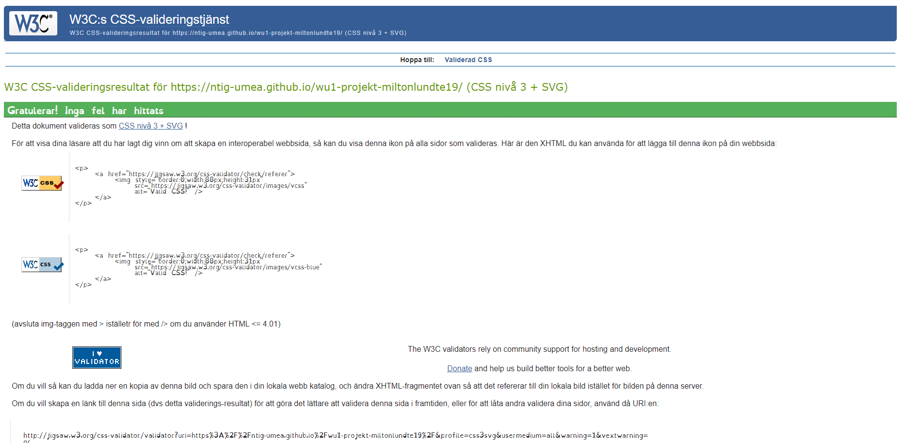

# Slutprodjekt webb 1 - M.L 

Milton Lund  07/06-2021

## Inledning

syftet med deta arbete var att förbeetra någonting från en vebsida och jag valde att förbetra hur stilarna ser utt i olika storlekar av scermar och hur menyn syns. 

## Bakgrund

efter vi blev presenterat arbetet så skule vi börja planera av vad vi vile gjöra och skriva ner det. Jag bestemde mej för att gjöra om några delar av legimus hemsida så att bildscalningen och menyn fungerade betre. Efter man hade skrivit ner vad man skule gjöra så skule man börja gjöra sidan sedan så ska man validera sidan också ska man testa den på bland anat i andra vebläsare.

### Bild exempel på validerings sida:

##### html

##### css

## Positiva erfarenheter

Nog för att det har gåt sakta att seta in delarna så tyker jag att det är endadelen som har gåt relativt bra.

## Negativa erfarenheter

det som jag tyker int har gåt bra är att gjöra en planering i början av uppgiften och att jag gjobar lite för sakta som gjorde att jag inte han gjöra färdigt sidan. För att jag ska undvika deta i farmtida prodjek så måste nog jag tenka dem hära sakerna.

## Sammanfattning

Efter deta prdjekt så förstår jag lite mer om varför att man ska gjöra en planering så att man hiner gjöra färdigt ett prodjekt. Jag har väl också lärt mej lite mer om hur html och css fungerar och fåt mer träning på det. Eftersom att jag inte harn färdigt med sidan så fins det myket utryme för att utvekla "produkten" men även om jag han färdigt med det jag ville så tror jag att det fins mer utveklings möjligheter för orginal sidan (legimus). Men ut av det jag har hunigt tyker jag att det ser ok ut. 